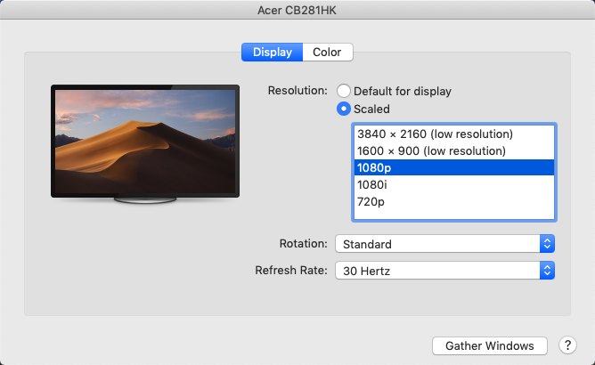

# RotateDisplay
Rotate display of external monitor on macOS.

## Usage

* Download and open `RotateDisplay.applescript` with `Script Editor`
* Modify parameter `externalDisplay` to your secondary monitor's name
* Click `Run the Script`

## FAQ
### How to find my secondary monitor's name?
* Click `🍎` -> `System Preferences...` -> `Displays`
* The secondary monitor's name would appear on the title bar of popup window
  * like "Acer CB281HK" in the image below:

